Design of OpenPipeline
================

<!-- README.md is generated by running 'quarto render README.qmd' -->

## Pipeline architecture overview

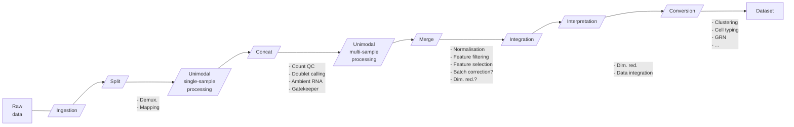

Figure 1: Overview single cell processing steps in OpenPipeline.
Rectangles are data objects, parallelograms are Viash modules or
subworkflows.

## Decisions (to make)

-   Try to avoid pipeline metromaps
    ([Example](https://github.com/nf-core/rnaseq/blob/master/docs/images/nf-core-rnaseq_metro_map_grey.png)).
    Instead, multiple pipelines using a different subset or ordering of
    the same components can be implemented to suit the needs of any
    particular requirement.

-   Division of responsibilities:

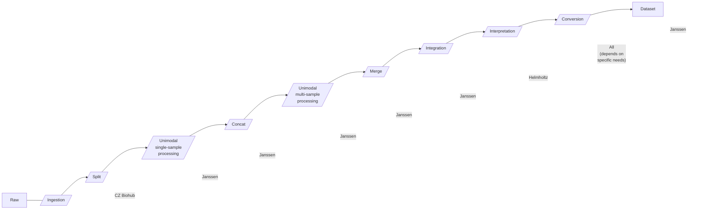

Figure 2: Division of responsibilities.

<!-- conversion pipeline? -->

## Use cases

> **Note**
>
> In these use-cases, `Interpretation`, `Conversion` and `Dataset` are
> omitted because they are the same in every use case.

### A single unimodal sample

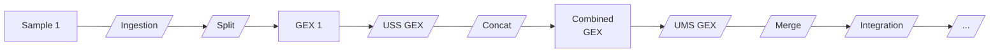

Figure 3: Example of how the concat and merges work.  
GEX: Gene-expression. USS: Unimodal single-sample processing. UMS:
Unimodal multi-sample processing.

### A single multimodal sample

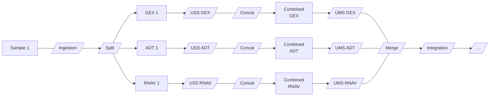

Figure 4: Example of how the concat and merges work.  
GEX: Gene-expression. ADT: Antibody-Derived Tags. RNAV: RNA Velocity.
USS: Unimodal single-sample processing. UMS: Unimodal multi-sample
processing.

### Multiple unimodal samples

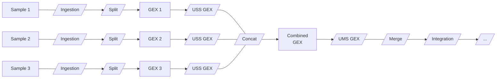

Figure 5: Example of how the concat and merges work.  
GEX: Gene-expression. USS: Unimodal single-sample processing. UMS:
Unimodal multi-sample processing.

### Multiple multimodal samples

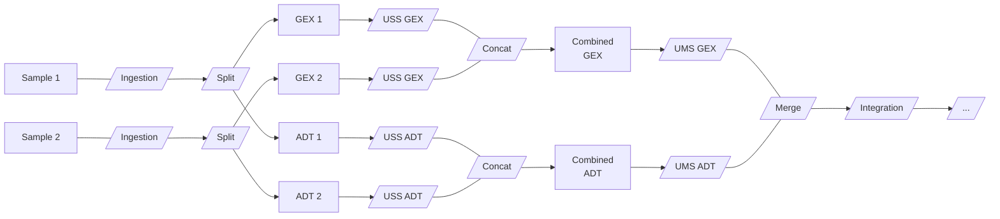

Figure 6: Example of how the concat and merges work.  
GEX: Gene-expression. ADT: Antibody-Derived Tags. USS: Unimodal
single-sample processing. UMS: Unimodal multi-sample processing.

## Subworkflows

### Ingestion

Purpose: Convert raw sequencing data or count tables into MuData data
for further processing.

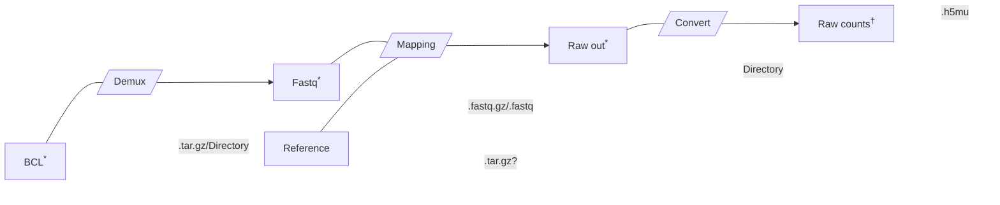

Figure 7: Ingestion pipeline.  
`*`: Possible entry points.  
`†`: Output file(s)

### Single-sample unimodal processing

Purpose: Per modality fitering pipelines are available to select true
from false cells.

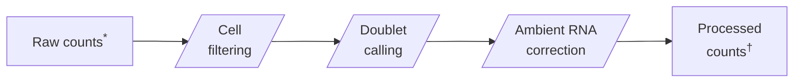

Figure 8: Single-sample processing pipeline.  
`*`: Possible entry points.  
`†`: Output file(s)

### Multi-sample unimodal processing

At the final stage of this part the different modalities are merged into
a single muon object. Merging can be performed by combining the
different filterings or only using a single filtering.

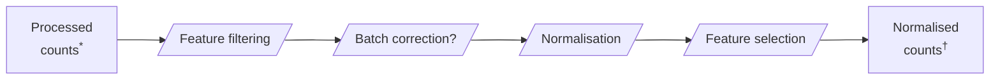

Figure 9: Multi-sample processing pipeline.  
`*`: Possible entry points.  
`†`: Output file(s)

### Integration

Purpose: Performs an integration pipeline for single cell data based on
a single or multiple modalities.

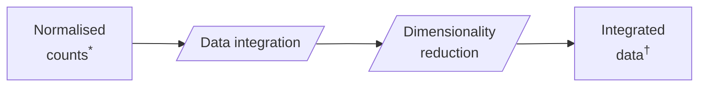

Figure 10: Integration pipeline.  
`*`: Possible entry points.  
`†`: Output file(s)

### Interpretation

Purpose: Take different dataset annotations and combine them together
into a single enriched dataset. The idea is to have a diff_muon object,
i.e. a muon object containing the changes of the original object where
data from the diff_muon will be pushed to the original muon object.

> **Warning**
>
> This is what we did a time ago and it has the drawback that it could
> make everything very slow. So we need to be able to aggregate diffs
> before adding them to the final object.

<!--

---

--- 

---

## Version 2021-10-13

__Questions:__

1. What with metadata on the cells?
2. How do we define cell ids? At the moment we use the default as in scanpy BCODE-DIGIT-SAMPLEID
3. Bookkeeping
4. Where do we do Ab/lipid/vcf demultiplexing? (After the count step?)
5. Meta-cells
6. Count imputations
7. Compute environment awareness ==> GPUs/TPUs/...

## Ingestion

Pipelines list:

- seq_demultiplex: Converts BCL to read data
- [read_mapping](pipeline/read_mapping.md): Converts reads/UMIs to count matrices
- input_conversion: Converts count matrices from different formats into h5ad data objects containing a single modality and sample
- vdj_mapping: Converts reads to clonotypes

## Per sample processing

### Concat

Purpose: Combining different samples together over different modalities.

Pipeline list: 

- [concat](pipeline/concat.md): Takes multiple single sample muons and combines them together into a single multi-sample muon object.

### Integration

### Transformation

Purpose: Perform transformations on the initial multi-sample muon object to generate novel annotations onto the dataset for further analysis.

Pipeline list:

- [Clustering](pipeline/clustering.md)
- TI: Trajectory inference
- GRN: Gene regulatory network reconstruction
- Celltyping
- ...

### Reporting

Purpose: Provide standardized reporting on the final dataset.

Pipeline list: 

- qc: General QC report on the data.
- pseudobulk: Differential expression report/pipeline.
- compositional analysis: Describing and comparing the distributions of different annotations. 
- ...

__This can be very flexible, we now use a ipynb that we can add to the pipelines that gets generated with the resulting data. As such we can reuse some standardized notebooks. The difficulty here is the dependency managment in the notebook.__

### Data definition

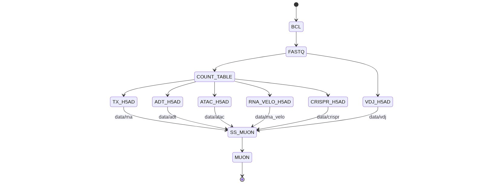

## Version 2021-09-29

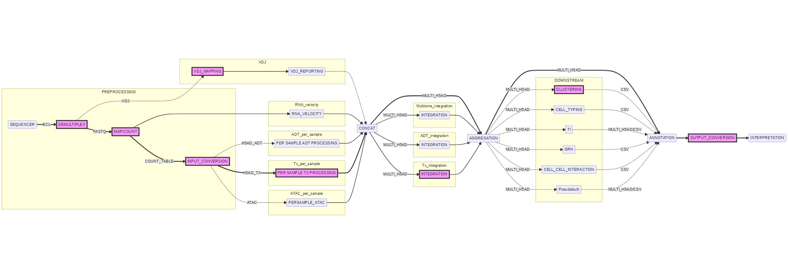
_Overview single cell processing pipelines._

Remarks:
1. What with multi-modal data integration? 
2. RNA-velocity is starting at the wrong location since it is only a different mapping step.
3. Muon objects to be used for the multi-modal data.

-->
