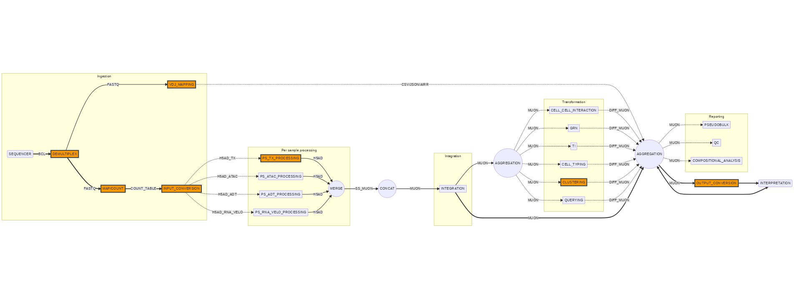

# Openpipeline - design(20211013)

__Questions:__

1. What with metadata on the cells?
2. How do we define cell ids?
3. Bookkeeping

# Pipeline architecture overview

_Overview single cell processing pipelines in openpipeline. Every rectangle is a pipeline or component by itself of which multiple versions can exist. Data aggregation is performed in the circles. The major parts of the pipeline consist of Ingestion, Per sample processing, Integration, Transformation and Reporting._ 

## Ingestion

Purpose: Convert raw sequencing data or count tables into h5ad data for further processing. 

Pipelines list: 
- demultiplexing: Converts BCL to read data
- map/count: Converts reads/UMIs to count matrices
- input_conversion: Converts count matrices from different formats into h5ad data objects containing a single modality
- vdj_mapping: Converts reads to clonotypes

## Per sample processing

Purpose: Filters data from multiple modalities per modality and then merges the resulting modalities into a single muon object. The merging will combine the filtered datasets depending on the different filterings combined.

Pipelines list: 
- ps_tx_processing: Filters raw transcriptomics count data using the count profiles
- ps_adt_processing: Filters raw adt count data using the count profiles
- ps_atac_processing: Filters raw atac count data 
- ps_rna_velo_processing: Filters raw transcriptomics count data with splicing variants using the count profiles __As mentioned last time, this could be important for sample QC.__
- merge: Combine the data from different single modalities for a single sample into a merged dataset. This implies that there is a method to merge the data, i.e. intersection, union, or master, i.e. only retain cells in a specific modality.

### Concat

Purpose: Combining different samples together over different modalities.

Pipeline list: 
- concat: Takes multiple single sample muons and combines them together into a single multi-sample muon object.

### Integration

Purpose: Performs an integration pipeline for single cell data based on a single or multiple modalities. 

Pipeline list: 
- integration: Takes a multi-sample muon data object and generates a projection over the data for the mulitple samples in the object.

### Transformation

Purpose: Perform additional operations on the initial multi-sample muon object to generate additional insights onto the dataset. 

### Aggregation

Purpose: Take different dataset annotations and combine them together into a single enriched dataset.

### Reporting

## First general architecture (20210929)

_Overview single cell processing pipelines._

Remarks:
1. What with multi-modal data integration? 
2. RNA-velocity is starting at the wrong location since it is only a different mapping step.
3. Muon objects to be used for the multi-modal data.

