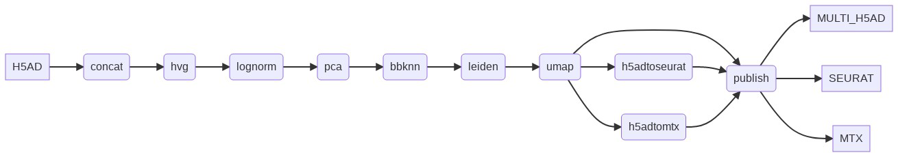

# Integration pipelines

Input: 
- 

## Transcriptomics only

### No correction

### Harmony

_Schematic overview Harmony pipeline_

__?? How do we describe all the parameters, ideal would be to generate from the specific components in the pipeline. Again we can add all the different parameters and the hidden parameters.__

### bbknn

_Schematic overview bbknn pipeline_

### scanorama

## ADT and transcriptomics

### TotalVI

### WNN

