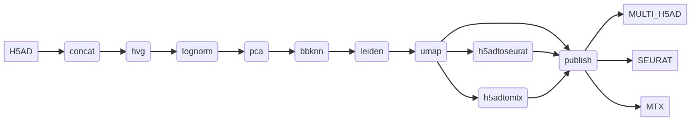

# Integration pipelines

Input: 
- 

## Transcriptomics only

### No correction

### Harmony


_Schematic overview Harmony pipeline_

Single modality, multi-sample:

Required fields:
_modality_ : The modality containing the count object

1. Feature selection

Input:

    - _modality_/raw
    - flavor

Output: 

    - _modality_/var/hvg

2. Normalization

Input: 

    - _modality_/raw

Output: 

    - _modality_/lognorm

3. Dimensionality reduction

Input:

    - _modality_/lognorm

Output:

    - _modality_/obsm/X_pca

4. Harmony integration

Input: 

    - _modality_/obsm/X_pca
    - _modality_/obs/batch, theta_batch; _modality_/obs/tissue, theta_tissue

Output:

    - _modality_/obsm/X_harmony

5. Network neighborhood:

Input:

    - _modality_/obsm/X_harmony

Output:

    - _modality_/uns/neighbors

6. Projection: 

Input: 

    - _modality_/obsm/X_harmony

Output: 

    - _modality_/obsm/X_umap

7. Clustering:

Input: 

    - _modality_/uns/neighbors
    - suffix

Output: 

    - obs/clusters-_suffix_


Idea??

```
if ( modality/var/hvg is not set):
    result = do_method

    data["modality/var/hvg"] = result

```
__?? How do we describe all the parameters, ideal would be to generate from the specific components in the pipeline. Again we can add all the different parameters and the hidden parameters.__

### bbknn



_Schematic overview bbknn pipeline_


### scanorama


## ADT and transcriptomics

### TotalVI

### WNN


